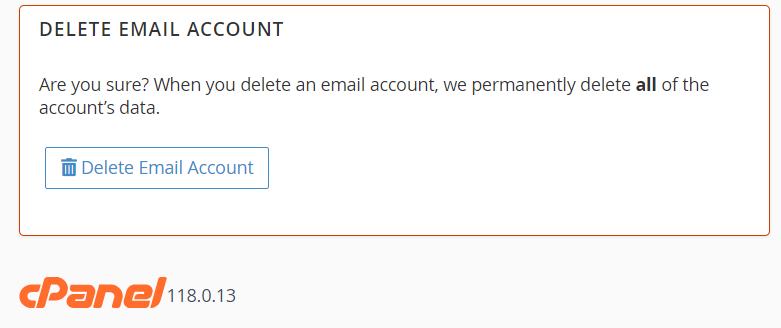

### ***Est-il possible de créer un sous-domaine directement depuis une application PHP/Symfony sans l'accès Root au serveur ?***

La réponse est oui !

J'ai eu envie de créer un système de staging il y a quelque temps pour plusieurs raisons :

- Montrer aux clients l'avancement de leurs projets de manière rapide tout en restant sur mon hébergement.
- Par flemme de passer à chaque fois par un terminal (j'aimerais tout faire en un clic).
- Créer un système de blog gratuit format CMS dont la mise en production est entièrement automatisée par la suite.
\

La contrainte principale a été de ne pas céder à la facilité car une fonctionnalité comme celle-ci est bien plus facile sur un serveur privé que sur un mutualisé sans accès root.
\
\
**Par chance, sur mon hébergement, il y a Cpanel d'installé !**

Non seulement Cpanel possède une API permettant quasiment toutes les actions permises sur l'interface qu'on a l'habitude de voir, mais elle est également écrite en Perl **ET PHP**.

-------
\

\
Par exemple, la suppression d'un compte mail equivaux à:

```bash
uapi --output=jsonpretty \
  --user=username \
  Email \
  delete_pop \
  email='user@domain.com'
  ```

## ***Création d'un sous-domaine***

Mais ce qui nous intereresse, c'est surtout [La création d'un sous domaine](https://api.docs.cpanel.net/openapi/cpanel/operation/addsubdomain/) !

```bash
uapi --output=jsonpretty \
  --user=username \
  SubDomain \
  addsubdomain \
  domain='subdomain' \
  rootdomain='example.com'
```

Et la documentation est très pratique car elle nous offre directement le code PHP à intégrer au projet.

```php
//--------------------------------------------------------------------------------------
// Instructions:
//--------------------------------------------------------------------------------------
// <theme-name> is the theme assigned to cPanel account.
// 1) cd /usr/local/cpanel/base/frontend/<theme_name>
// 2) mkdir api_examples
// 3) cd api_examples
// 4) create a file SubDomain_addsubdomain.live.php and put this code into that file.
// 5) In your browser login to a cPanel account.
// 6) Manually change the url from: .../frontend/<theme_name>/
//    to .../frontend/<theme_name>/api_examples/SubDomain_addsubdomain.live.php
//--------------------------------------------------------------------------------------

// Instantiate the CPANEL object.
require_once "/usr/local/cpanel/php/cpanel.php";

// Print the header
header('Content-Type: text/plain');

// Connect to cPanel - only do this once.
$cpanel = new CPANEL();

// Call the API
$response = $cpanel->uapi(
    'SubDomain',
    'addsubdomain',
    array (
        'domain' => 'subdomain',
        'rootdomain' => 'example.com',
    )
);

// Handle the response
if ($response['cpanelresult']['result']['status']) {
    $data = $response['cpanelresult']['result']['data'];
    // Do something with the $data
    // So you can see the data shape we print it here.
    print to_json($data);
}
else {
    // Report errors:
    print to_json($response['cpanelresult']['result']['errors']);
}

// Disconnect from cPanel - only do this once.
$cpanel->end();

//--------------------------------------------------------------------------------------
// Helper function to convert a PHP value to html printable json
//--------------------------------------------------------------------------------------
function to_json($data) {
    return json_encode($data, JSON_PRETTY_PRINT);
}
```

## ***Comment tout ça fonctionne ?***

Cpanel installé sur le serveur mutualisé permet à l'utilisateur d'effectuer toutes les actions qu'il souhaite.
 L'interface Cpanel communique à travers l'API pour exécuter différentes actions.

Beaucoup de paramètres entrent en compte dans le cas d'un hébergement mutualisé car il y a un cloisonnement des autorisations, de la portée des actions, et des possibilités de toucher à des éléments essentiels au fonctionnement de l'hébergement.

J'ai bien évidemment demandé au service technique de l'hébergeur, avant d'effectuer quoi que ce soit, si l'utilisation de l'API n'allait pas à l'encontre de leurs conditions d'utilisation

**Il y à deux choix qui s'offrent à nous:**

- Communiquer avec l'Api en PHP.

*Ce qui donnerait:*
\
**Ma-requete-en-PHP -> UAPI -> CPANEL.**

- Utiliser les commandes terminals disponibles.

*Ce qui donnerait:*
\
**Mon code PHP exécutant une commande -> Terminal SSH -> UAPI -> CPANEL**

S'agissant la d'un Proof of Concept, aussi étonnant que cela puisse paraître, la seconde solution a été la plus intuitive.

J'ai choisi d'utiliser les commandes terminal, mais avec l'idée en tête d'utiliser par la suite l'API en PHP quand j'aurais éliminé tous les éléments inconnus de la fonctionnalité.
J'ai également choisi de ne pas utiliser le [Process Component](https://symfony.com/doc/current/components/process.html) de Symfony car il alourdissait mes essais.

## ***Clonage du repository Git + Installation des dépendances (Staging)***

C'est bien beau d'avoir un sous-domaine, maintenant il faut l'utiliser !

Je me suis créé un petit projet Symfony qui servira de test pour mon staging (cf. : Mon premier objectif).
L'idée est d'avoir une interface à la manière d'Heroku où j'aurais seulement à indiquer l'URL de mon repository Git.

En utilisant les commandes shell, j'ai réussi à me débrouiller pour cloner le repo puis installer les dépendances.
**La méthode qui permet le clonage du repository:**

```php
    /**
     * Clones a repository using Git.
     *
     * @param string $username The username for authentication.
     * @param string $token The token for authentication.
     * @param string $repositoryUrl The URL of the repository to clone.
     * @param string $projectRoot The root directory where the repository will be cloned.
     * @return JsonResponse The response containing the output of the clone command.
     * @throws InvalidArgumentException If any of the required parameters is empty.
     * @throws JsonException If the clone command fails.
     */
    public function cloneRepo(string $username, string $token, string $repositoryUrl, string $projectRoot): JsonResponse
    {
        if (empty($username) || empty($token) || empty($repositoryUrl) || empty($projectRoot)) {
            throw new InvalidArgumentException('Username, token, repository URL or project root is null');
        }
        $repositoryUrl = str_replace('https://', '', $repositoryUrl);
        
        $command = sprintf('git clone https://%s:%s@%s', escapeshellarg($username), escapeshellarg($token), escapeshellarg($repositoryUrl));
        exec("cd " . escapeshellarg($projectRoot) . " && $command 2>&1", $output, $returnVar);

        if ($returnVar !== 0) {
            throw new JsonException(implode("\n", $output));
        }
        return new JsonResponse($output);
    }
```

**Puis une methode pour installer les dependances avec composer:**

```php
    /**
     * Install dependencies using Composer.
     *
     * @param string $homeDir The home directory.
     * @param string $projectDir The project directory.
     * @return JsonResponse The JSON response containing the output of the Composer installation.
     * @throws InvalidArgumentException If the home directory or project directory is empty.
     * @throws JsonException If the Composer installation fails.
     */
    public function installDependencies(string $homeDir, string $projectDir): JsonResponse
    {
        if (empty($homeDir) || empty($projectDir)) {
            throw new InvalidArgumentException('Home directory or project directory is null');
        }
        putenv("HOME=" . escapeshellarg($homeDir));
        putenv("COMPOSER_HOME=" . escapeshellarg($projectDir));
        $composerInstallCommand = "cd " . escapeshellarg($projectDir) . " && " . escapeshellarg(self::COMPOSER_ROOT) . " install 2>&1";

        exec($composerInstallCommand, $output, $returnVar);

        if ($returnVar !== 0) {
            throw new JsonException(implode("\n", $output));
        }
        return new JsonResponse($output);
    }
```

## ***Et pour le CMS ?***

Bien que je puisse créer une sécurité suffisante pour éviter la plupart des attaques potentielles depuis l'app d'un client,
le fait que ce système se trouve sur un hébergement mutualisé rend le cloisonnement beaucoup plus complexe.

L'idée est donc de créer des applications indépendantes pour chaque nouveau blog d'utilisateur. Il faut également réfléchir à la limitation du nombre de pages, du poids total de l'app, du type de contenu uploadable, etc.

Il existe maintes solutions alternatives possibles pour obtenir une fonctionnalité similaire.

Cependant, pour le défi, je tenterai de faire avec les contraintes présentées, dans un prochain article !

## Les actions de l'api executable en Terminal en cadeau

[LA DOC DE L'API CPANEL COMPLETE ICI :D](https://api.docs.cpanel.net/cpanel/introduction/)

<details>
<summary>Et les fonctions</summary>

The following calls are available:\
\
AccountEnhancements::has_enhancement\
AccountEnhancements::list\
AuditLog::get_api_log\
Backup::fullbackup_to_ftp\
Backup::fullbackup_to_homedir\
Backup::fullbackup_to_scp_with_key\
Backup::fullbackup_to_scp_with_password\
Backup::list_backups\
Backup::restore_databases\
Backup::restore_email_filters\
Backup::restore_email_forwarders\
Backup::restore_files\
Bandwidth::get_enabled_protocols\
Bandwidth::get_retention_periods\
Bandwidth::query\
Batch::strict\
BlockIP::add_ip\
BlockIP::remove_ip\
BoxTrapper::blacklist_messages\
BoxTrapper::delete_messages\
BoxTrapper::deliver_messages\
BoxTrapper::get_allowlist\
BoxTrapper::get_blocklist\
BoxTrapper::get_configuration\
BoxTrapper::get_email_template\
BoxTrapper::get_forwarders\
BoxTrapper::get_ignorelist\
BoxTrapper::get_log\
BoxTrapper::get_message\
BoxTrapper::get_status\
BoxTrapper::ignore_messages\
BoxTrapper::list_email_templates\
BoxTrapper::list_queued_messages\
BoxTrapper::process_messages\
BoxTrapper::reset_email_template\
BoxTrapper::save_configuration\
BoxTrapper::save_email_template\
BoxTrapper::set_allowlist\
BoxTrapper::set_blocklist\
BoxTrapper::set_forwarders\
BoxTrapper::set_ignorelist\
BoxTrapper::set_status\
BoxTrapper::whitelist_messages\
Branding::get_application_information\
Branding::get_applications\
Branding::get_available_applications\
Branding::get_information_for_applications\
Branding::include\
CCS::add_delegate\
CCS::list_delegates\
CCS::list_users\
CCS::remove_delegate\
CCS::update_delegate\
CSVImport::doimport\
CacheBuster::read\
CacheBuster::update\
Chkservd::get_exim_ports\
Chkservd::get_exim_ports_ssl\
Chrome::get_dom\
ClamScanner::check_disinfection_status\
ClamScanner::disinfect_files\
ClamScanner::get_scan_paths\
ClamScanner::get_scan_status\
ClamScanner::list_infected_files\
ClamScanner::start_scan\
ContactInformation::set_email_addresses\
ContactInformation::unset_email_addresses\
Contactus::is_enabled\
DAV::disable_shared_global_addressbook\
DAV::enable_shared_global_addressbook\
DAV::get_calendar_contacts_config\
DAV::has_shared_global_addressbook\
DAV::is_ccs_enabled\
DAV::is_dav_service_enabled\
DAV::is_horde_enabled\
DCV::check_domains_via_dns\
DCV::check_domains_via_http\
DCV::ensure_domains_can_pass_dcv\
DNS::ensure_domains_reside_only_locally\
DNS::has_local_authority\
DNS::lookup\
DNS::mass_edit_zone\
DNS::parse_zone\
DNS::swap_ip_in_zones\
DNSSEC::activate_zone_key\
DNSSEC::add_zone_key\
DNSSEC::deactivate_zone_key\
DNSSEC::disable_dnssec\
DNSSEC::enable_dnssec\
DNSSEC::export_zone_dnskey\
DNSSEC::export_zone_key\
DNSSEC::fetch_ds_records\
DNSSEC::import_zone_key\
DNSSEC::remove_zone_key\
DNSSEC::set_nsec3\
DNSSEC::unset_nsec3\
DirectoryIndexes::get_indexing\
DirectoryIndexes::list_directories\
DirectoryIndexes::set_indexing\
DirectoryPrivacy::add_user\
DirectoryPrivacy::configure_directory_protection\
DirectoryPrivacy::delete_user\
DirectoryPrivacy::is_directory_protected\
DirectoryPrivacy::list_directories\
DirectoryPrivacy::list_users\
DirectoryProtection::list_directories\
DomainInfo::domains_data\
DomainInfo::list_domains\
DomainInfo::main_domain_builtin_subdomain_aliases\
DomainInfo::single_domain_data\
DynamicDNS::create\
DynamicDNS::delete\
DynamicDNS::list\
DynamicDNS::recreate\
DynamicDNS::set_description\
EA4::get_php_recommendations\
EA4::get_recommendations\
Email::account_name\
Email::add_auto_responder\
Email::add_domain_forwarder\
Email::add_forwarder\
Email::add_list\
Email::add_mailman_delegates\
Email::add_mx\
Email::add_pop\
Email::add_spam_filter\
Email::browse_mailbox\
Email::change_mx\
Email::check_fastmail\
Email::count_auto_responders\
Email::count_filters\
Email::count_forwarders\
Email::count_lists\
Email::count_pops\
Email::delete_auto_responder\
Email::delete_domain_forwarder\
Email::delete_filter\
Email::delete_forwarder\
Email::delete_held_messages\
Email::delete_list\
Email::delete_mx\
Email::delete_pop\
Email::disable_filter\
Email::disable_mailbox_autocreate\
Email::disable_spam_assassin\
Email::disable_spam_autodelete\
Email::disable_spam_box\
Email::dispatch_client_settings\
Email::edit_pop_quota\
Email::enable_filter\
Email::enable_mailbox_autocreate\
Email::enable_spam_assassin\
Email::enable_spam_box\
Email::fetch_charmaps\
Email::fts_rescan_mailbox\
Email::generate_mailman_otp\
Email::get_auto_responder\
Email::get_charsets\
Email::get_client_settings\
Email::get_default_email_quota\
Email::get_default_email_quota_mib\
Email::get_disk_usage\
Email::get_filter\
Email::get_held_message_count\
Email::get_lists_total_disk_usage\
Email::get_mailbox_autocreate\
Email::get_mailman_delegates\
Email::get_main_account_disk_usage\
Email::get_main_account_disk_usage_bytes\
Email::get_max_email_quota\
Email::get_max_email_quota_mib\
Email::get_pop_quota\
Email::get_spam_settings\
Email::get_webmail_settings\
Email::has_delegated_mailman_lists\
Email::has_plaintext_authentication\
Email::hold_outgoing\
Email::list_auto_responders\
Email::list_default_address\
Email::list_domain_forwarders\
Email::list_filters\
Email::list_filters_backups\
Email::list_forwarders\
Email::list_forwarders_backups\
Email::list_lists\
Email::list_mail_domains\
Email::list_mxs\
Email::list_pops\
Email::list_pops_with_disk\
Email::list_system_filter_info\
Email::passwd_list\
Email::passwd_pop\
Email::release_outgoing\
Email::remove_mailman_delegates\
Email::reorder_filters\
Email::set_always_accept\
Email::set_default_address\
Email::set_list_privacy_options\
Email::set_manual_mx_redirects\
Email::stats_db_status\
Email::store_filter\
Email::suspend_incoming\
Email::suspend_login\
Email::suspend_outgoing\
Email::terminate_mailbox_sessions\
Email::trace_delivery\
Email::trace_filter\
Email::unset_manual_mx_redirects\
Email::unsuspend_incoming\
Email::unsuspend_login\
Email::unsuspend_outgoing\
Email::verify_password\
EmailAuth::disable_dkim\
EmailAuth::enable_dkim\
EmailAuth::ensure_dkim_keys_exist\
EmailAuth::fetch_dkim_private_keys\
EmailAuth::install_dkim_private_keys\
EmailAuth::install_spf_records\
EmailAuth::validate_current_dkims\
EmailAuth::validate_current_ptrs\
EmailAuth::validate_current_spfs\
ExternalAuthentication::add_authn_link\
ExternalAuthentication::configured_modules\
ExternalAuthentication::get_authn_links\
ExternalAuthentication::has_external_auth_modules_configured\
ExternalAuthentication::remove_authn_link\
Features::get_feature_metadata\
Features::has_feature\
Features::list_features\
Fileman::autocompletedir\
Fileman::empty_trash\
Fileman::get_file_content\
Fileman::get_file_information\
Fileman::list_files\
Fileman::save_file_content\
Fileman::transcode\
Fileman::upload_files\
Ftp::add_ftp\
Ftp::allows_anonymous_ftp\
Ftp::allows_anonymous_ftp_incoming\
Ftp::delete_ftp\
Ftp::ftp_exists\
Ftp::get_ftp_daemon_info\
Ftp::get_port\
Ftp::get_quota\
Ftp::get_welcome_message\
Ftp::kill_session\
Ftp::list_ftp\
Ftp::list_ftp_with_disk\
Ftp::list_sessions\
Ftp::passwd\
Ftp::server_name\
Ftp::set_anonymous_ftp\
Ftp::set_anonymous_ftp_incoming\
Ftp::set_homedir\
Ftp::set_quota\
Ftp::set_welcome_message\
GPG::delete_keypair\
GPG::export_public_key\
GPG::export_secret_key\
GPG::generate_key\
GPG::import_key\
GPG::list_public_keys\
GPG::list_secret_keys\
ImageManager::convert_file\
ImageManager::create_thumbnails\
ImageManager::get_dimensions\
ImageManager::resize_image\
Integration::fetch_url\
JetBackup::addQueueDownload\
JetBackup::addQueueRestore\
JetBackup::addQueueSnapshot\
JetBackup::decode_base64\
JetBackup::deleteDownload\
JetBackup::encode_base64\
JetBackup::fileManager\
JetBackup::getAccountDetails\
JetBackup::getBackupDownloads\
JetBackup::getConfigurations\
JetBackup::getDownload\
JetBackup::getGDPR\
JetBackup::getInfo\
JetBackup::listBackups\
JetBackup::listDownloads\
JetBackup::listPermissions\
JetBackup::listQueueItems\
JetBackup::manageAccount\
JetBackup::manageBackup\
JetBackup::manageGDPR\
JetBackup::unserialize\
JetBackup::uri_escape\
JetBackup::uri_escape_utf8\
JetBackup::uri_unescape\
KnownHosts::create\
KnownHosts::delete\
KnownHosts::update\
KnownHosts::verify\
LangPHP::php_get_domain_handler\
LangPHP::php_get_impacted_domains\
LangPHP::php_get_installed_versions\
LangPHP::php_get_system_default_version\
LangPHP::php_get_vhost_versions\
LangPHP::php_ini_get_user_basic_directives\
LangPHP::php_ini_get_user_content\
LangPHP::php_ini_get_user_paths\
LangPHP::php_ini_set_user_basic_directives\
LangPHP::php_ini_set_user_content\
LangPHP::php_set_vhost_versions\
LastLogin::get_last_or_current_logged_in_ip\
Locale::get_attributes\
Locale::list_locales\
Locale::set_locale\
LogManager::get_settings\
LogManager::list_archives\
LogManager::set_settings\
Mailboxes::expunge_mailbox_messages\
Mailboxes::expunge_messages_for_mailbox_guid\
Mailboxes::get_mailbox_status_list\
Mailboxes::has_utf8_mailbox_names\
Mailboxes::set_utf8_mailbox_names\
Market::cancel_pending_ssl_certificate\
Market::create_shopping_cart\
Market::create_shopping_cart_non_ssl\
Market::get_all_products\
Market::get_build_cart_url\
Market::get_certificate_status_details\
Market::get_completion_url\
Market::get_license_info\
Market::get_login_url\
Market::get_pending_ssl_certificates\
Market::get_product_info\
Market::get_provider_specific_dcv_constraints\
Market::get_providers_list\
Market::get_ssl_certificate_if_available\
Market::process_ssl_pending_queue\
Market::request_ssl_certificates\
Market::set_status_of_pending_queue_items\
Market::set_url_after_checkout\
Market::validate_login_token\
Mime::add_handler\
Mime::add_hotlink\
Mime::add_mime\
Mime::add_redirect\
Mime::delete_handler\
Mime::delete_hotlink\
Mime::delete_mime\
Mime::delete_redirect\
Mime::get_redirect\
Mime::list_handlers\
Mime::list_hotlinks\
Mime::list_mime\
Mime::list_redirects\
Mime::redirect_info\
ModSecurity::disable_all_domains\
ModSecurity::disable_domains\
ModSecurity::enable_all_domains\
ModSecurity::enable_domains\
ModSecurity::has_modsecurity_installed\
ModSecurity::list_domains\
Monitoring::create_contact\
Monitoring::create_site_monitor\
Monitoring::create_site_monitor_shopping_cart\
Monitoring::get_all_site_monitors\
Monitoring::get_build_cart_url\
Monitoring::get_completion_url\
Monitoring::get_contact\
Monitoring::get_site_monitor\
Monitoring::get_store_email_address\
Monitoring::get_user_status_from_store\
Monitoring::list_contacts\
Monitoring::load_user\
Monitoring::remove_contact\
Monitoring::remove_site_monitor\
Monitoring::remove_user\
Monitoring::save_user\
Monitoring::update_contact\
Mysql::add_host\
Mysql::add_host_note\
Mysql::check_database\
Mysql::create_database\
Mysql::create_user\
Mysql::delete_database\
Mysql::delete_host\
Mysql::delete_user\
Mysql::dump_database_schema\
Mysql::get_host_notes\
Mysql::get_privileges_on_database\
Mysql::get_restrictions\
Mysql::get_server_information\
Mysql::list_databases\
Mysql::list_routines\
Mysql::list_users\
Mysql::locate_server\
Mysql::rename_database\
Mysql::rename_user\
Mysql::repair_database\
Mysql::revoke_access_to_database\
Mysql::set_password\
Mysql::set_privileges_on_database\
Mysql::update_privileges\
NVData::get\
NVData::set\
NginxCaching::clear_cache\
NginxCaching::disable_cache\
NginxCaching::enable_cache\
NginxCaching::reset_cache_config\
Notifications::get_notifications_count\
Parser::firstfile_relative_uri\
PassengerApps::disable_application\
PassengerApps::edit_application\
PassengerApps::enable_application\
PassengerApps::ensure_deps\
PassengerApps::list_applications\
PassengerApps::register_application\
PassengerApps::unregister_application\
PasswdStrength::get_required_strength\
Personalization::get\
Personalization::set\
Plugins::get_uuid\
Plugins::reset_uuid\
Postgresql::create_database\
Postgresql::create_user\
Postgresql::delete_database\
Postgresql::delete_user\
Postgresql::get_restrictions\
Postgresql::grant_all_privileges\
Postgresql::list_databases\
Postgresql::list_users\
Postgresql::rename_database\
Postgresql::rename_user\
Postgresql::rename_user_no_password\
Postgresql::revoke_all_privileges\
Postgresql::set_password\
Postgresql::update_privileges\
Pushbullet::send_test_message\
Quota::get_local_quota_info\
Quota::get_quota_info\
Resellers::list_accounts\
ResourceUsage::get_usages\
Restore::directory_listing\
Restore::get_users\
Restore::query_file_info\
Restore::restore_file\
SSH::get_port\
SSL::add_autossl_excluded_domains\
SSL::can_ssl_redirect\
SSL::delete_cert\
SSL::delete_csr\
SSL::delete_key\
SSL::delete_ssl\
SSL::disable_mail_sni\
SSL::enable_mail_sni\
SSL::fetch_best_for_domain\
SSL::fetch_cert_info\
SSL::fetch_certificates_for_fqdns\
SSL::fetch_key_and_cabundle_for_certificate\
SSL::find_certificates_for_key\
SSL::find_csrs_for_key\
SSL::generate_cert\
SSL::generate_csr\
SSL::generate_key\
SSL::get_autossl_excluded_domains\
SSL::get_autossl_pending_queue\
SSL::get_autossl_problems\
SSL::get_cabundle\
SSL::get_cn_name\
SSL::install_ssl\
SSL::installed_host\
SSL::installed_hosts\
SSL::is_autossl_check_in_progress\
SSL::is_mail_sni_supported\
SSL::is_sni_supported\
SSL::list_certs\
SSL::list_csrs\
SSL::list_keys\
SSL::list_ssl_items\
SSL::mail_sni_status\
SSL::rebuild_mail_sni_config\
SSL::rebuildssldb\
SSL::remove_autossl_excluded_domains\
SSL::set_autossl_excluded_domains\
SSL::set_cert_friendly_name\
SSL::set_csr_friendly_name\
SSL::set_default_key_type\
SSL::set_key_friendly_name\
SSL::set_primary_ssl\
SSL::show_cert\
SSL::show_csr\
SSL::show_key\
SSL::start_autossl_check\
SSL::toggle_ssl_redirect_for_domains\
SSL::upload_cert\
SSL::upload_key\
ServerInformation::get_information\
ServiceProxy::get_service_proxy_backends\
ServiceProxy::set_service_proxy_backends\
ServiceProxy::unset_all_service_proxy_backends\
Session::create_temp_user\
Session::create_webmail_session_for_mail_user\
Session::create_webmail_session_for_mail_user_check_password\
Session::create_webmail_session_for_self\
SiteQuality::create_project\
SiteQuality::create_site_quality_user\
SiteQuality::delete_site_quality_user\
SiteQuality::get_all_scores\
SiteQuality::get_app_token\
SiteQuality::get_environment\
SiteQuality::has_site_quality_user\
SiteQuality::is_site_quality_user_enabled\
SiteQuality::reset_config\
SiteQuality::send_activation_email\
SiteQuality::verify_code\
SiteTemplates::list_site_templates\
SiteTemplates::list_user_settings\
SiteTemplates::publish\
Sitejet::add_api_token\
Sitejet::create_account\
Sitejet::create_restore_point\
Sitejet::create_website\
Sitejet::disk_quota_check\
Sitejet::do_not_delete_list\
Sitejet::get_all_sites_metadata\
Sitejet::get_all_user_sitejet_info\
Sitejet::get_api_token\
Sitejet::get_preview_url\
Sitejet::get_sitebuilder_domain_statuses\
Sitejet::get_sso_link\
Sitejet::get_templates\
Sitejet::get_user_site_metadata\
Sitejet::poll_publish\
Sitejet::publish\
Sitejet::restore_document_root\
Sitejet::set_template\
Sitejet::start_publish\
SpamAssassin::clear_spam_box\
SpamAssassin::get_symbolic_test_names\
SpamAssassin::get_user_preferences\
SpamAssassin::update_user_preference\
Stats::get_bandwidth\
Stats::get_site_errors\
Stats::list_sites\
Stats::list_stats_by_domain\
StatsBar::get_stats\
StatsManager::get_configuration\
StatsManager::save_configuration\
SubDomain::addsubdomain\
Team::add_roles\
Team::add_team_user\
Team::edit_team_user\
Team::list_team\
Team::list_team_ui\
Team::remove_roles\
Team::remove_team_user\
Team::set_contact_email\
Team::set_notes\
Team::set_password\
Team::set_roles\
Team::suspend_team_user\
Team::unsuspend_team_user\
TeamRoles::list_feature_descriptions\
Themes::get_theme_base\
Themes::list\
Themes::update\
Tokens::create_full_access\
Tokens::list\
Tokens::rename\
Tokens::revoke\
TwoFactorAuth::generate_user_configuration\
TwoFactorAuth::get_team_user_configuration\
TwoFactorAuth::get_user_configuration\
TwoFactorAuth::remove_user_configuration\
TwoFactorAuth::set_user_configuration\
UserManager::check_account_conflicts\
UserManager::create_user\
UserManager::delete_user\
UserManager::dismiss_merge\
UserManager::edit_user\
UserManager::list_users\
UserManager::lookup_service_account\
UserManager::lookup_user\
UserManager::merge_service_account\
UserManager::unlink_service_account\
UserTasks::delete\
UserTasks::retrieve\
Variables::get_server_information\
Variables::get_session_information\
Variables::get_user_information\
VersionControl::create\
VersionControl::delete\
VersionControl::retrieve\
VersionControl::update\
VersionControlDeployment::create\
VersionControlDeployment::delete\
VersionControlDeployment::retrieve\
WebDisk::delete_user\
WebDisk::set_homedir\
WebDisk::set_password\
WebDisk::set_permissions\
WebVhosts::list_domains\
WebVhosts::list_ssl_capable_domains\
WebmailApps::list_webmail_apps\
WordPressBackup::any_running\
WordPressBackup::cancel\
WordPressBackup::cleanup\
WordPressBackup::get_available_backups\
WordPressBackup::is_running\
WordPressBackup::start\
WordPressInstanceManager::cancel_scan\
WordPressInstanceManager::change_db_password\
WordPressInstanceManager::change_user_password\
WordPressInstanceManager::check_is_running\
WordPressInstanceManager::cleanup_scan\
WordPressInstanceManager::configure_autoupdate\
WordPressInstanceManager::get_api_version\
WordPressInstanceManager::get_instance_by_id\
WordPressInstanceManager::get_instances\
WordPressInstanceManager::get_latest_wordpress_version_from_wordpress_org\
WordPressInstanceManager::get_scan_results\
WordPressInstanceManager::is_installable_addon_available\
WordPressInstanceManager::start_scan\
WordPressManagerDeprecation::is_wptk_installed\
WordPressManagerDeprecation::is_wptk_supported\
WordPressRestore::any_running\
WordPressRestore::cleanup\
WordPressRestore::start\
WordPressSite::create\
WordPressSite::retrieve\
cPAddons::get_available_addons\
cPAddons::get_instance_settings\
cPAddons::list_addon_instances\
cPGreyList::disable_all_domains\
cPGreyList::disable_domains\
cPGreyList::enable_all_domains\
cPGreyList::enable_domains\
cPGreyList::has_greylisting_enabled\
cPGreyList::list_domains

</details>
