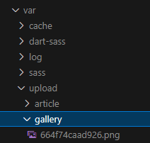

## ***Pourquoi ce questionnement ?***

J'ai été confronté à une problématique assez particulière concernant l'upload de fichiers sur Symfony il y a 6 mois de cela.

Durant mon apprentissage, il m'avait été dit, par un développeur senior, que l'upload de fichiers sur Symfony était soit dans le dossier public, soit dans le dossier var.

Pour le contexte : à plusieurs reprises, sur des projets clients assez simples, je leur fournis un formulaire pour uploader des images, PDF, Word, etc.

J'avais beau retourner la documentation de Symfony ou des bundles, je ne comprenais pas d'où venait le `var/` dont on me parlait et quelle utilité cela pouvait avoir.

[How to upload a file](https://symfony.com/doc/current/controller/upload_file.html).

```yaml
# config/services.yaml

# ...
parameters:
    brochures_directory: '%kernel.project_dir%/public/uploads/brochures'
```

*Dans le dossier public*

---------
Celle de VichUploader

[VichUploader](https://github.com/dustin10/VichUploaderBundle/blob/master/docs/usage.md)

```yaml
# config/packages/vich_uploader.yaml or app/config/config.yml
vich_uploader:
    db_driver: orm

    metadata:
        type: attribute

    mappings:
        products:
            uri_prefix: /images/products
            upload_destination: '%kernel.project_dir%/public/images/products'
            namer: Vich\UploaderBundle\Naming\SmartUniqueNamer
```

*Toujours dans le dossier public*

---------

[Upload in Form](https://symfonycasts.com/screencast/symfony-uploads/upload-in-form)

```php
/** @var UploadedFile $uploadedFile */
$uploadedFile = $form['imageFile']->getData();
$destination = $this->getParameter('kernel.project_dir').'/public/uploads/article_image';
```

*Encore dans le dossier public ?*

## ***Boh ça ne doit pas etre si terrible, si ?***

- Postulat :  
Le dossier `/public` met à disposition de manière **publique** les ressources.

- Question :  
Les ressources sont-elles toujours publiques ?

- Réponse :  
Les factures d'un client ne sont certainement pas publiques :D

Avec l'aide de Guillaume (un acolyte dev), nous nous mettons à la recherche d'un maximum d'informations à ce sujet et nous constatons plusieurs choses :

La définition exacte du dossier public implique qu'il s'agisse d'un dossier ne servant qu'aux ressources statiques.  
Les documentations d'autres frameworks poussent par ailleurs à uploader les fichiers dans un dossier en dehors du public.

Il y a une multitude d'arguments de sécurité qui confirment qu'on devrait éviter donc l'upload dans le public au profit d'un dossier non accessible publiquement. Et dans la logique cloud, une telle pratique permet plus facilement la scalabilité.

**L'OWASP s'en mêle !**

[File Upload Cheat Sheet](https://cheatsheetseries.owasp.org/cheatsheets/File_Upload_Cheat_Sheet.html)

```txt
Store the files on a different server. 
If that's not possible, store them outside of the webroot
In the case of public access to the files, 
use a handler that gets mapped to filenames inside the application (someid -> file.ext)
```

D'autres articles trouvés confirment la reflexion:

[Why is putting the image folder in the public directory of a web server not secure?](https://www.quora.com/Why-is-putting-the-image-folder-in-the-public-directory-of-a-web-server-not-secure-The-front-controller-should-already-take-care-of-public-folder-security)

[Why shouldn’t I upload files in the public directory?](https://forums.meteor.com/t/why-shouldnt-i-upload-files-in-the-public-directory/36899/3)

## ***Quel est la solution ?***

Comment est-il donc possible de servir les ressources sans pour autant compromettre la securité, tout en ayant un impact minimum sur la modification de la codebase ?

Tout n'est pas à jeter evidemment. La methode `asset()` de twig permet d'acceder au dossier `/public` qui ne sert **QUE** les ressources statiques du site.
Pour le reste , ca ira dans le dossier `/var` !

**Dans mon services.yaml:**

```yaml
parameters:
    var_file_dir: "%kernel.project_dir%/var/upload/"
```

**Dans un Controller:**

```php

#[Route('/file/{folder}/{filename}', name: 'app_file', methods: ['GET'])]
public function serveImage(string $folder, string $filename): BinaryFileResponse
{
    $fileDir = $this->getParameter('var_file_dir') ?? null;
    if (null === $fileDir) {
        throw new \Exception('Parameter "var_file_dir" is not set.');
    }

    $filePath = $fileDir . $folder . '/' . $filename;
    if (!file_exists($filePath)) {
        throw $this->createNotFoundException("the file does not exist.");
    }
    return new BinaryFileResponse($filePath);
}
```

**Dans mon Twig:**

```html

```

\
\
**Ce qui donne une structure comme celà, à l'abri des regards !**\
\

