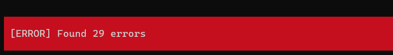
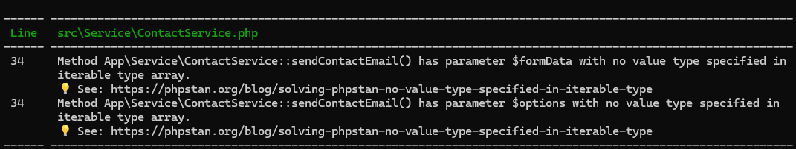
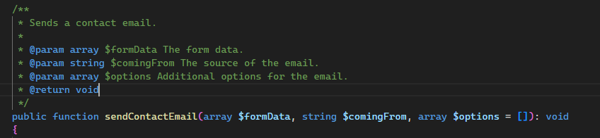
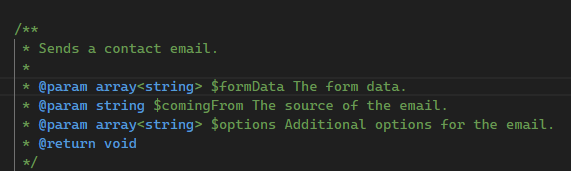
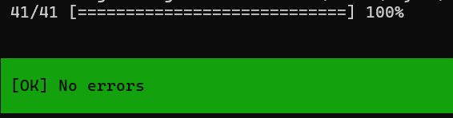
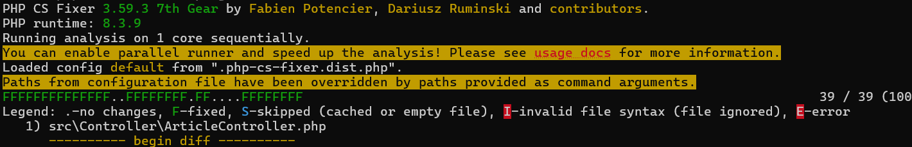
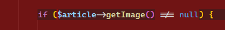
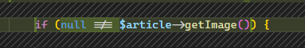

## Qu'est ce que c'est ces histoires de qualité de code ?

Beaucoup passeront leurs débuts de carrière à ne pas comprendre l'importance de ces petites lignes dans une fiche de poste, tant elles laissent planer un mystère sur le sujet dont on parle.
\
\
Si vous avez déjà lu "Code quality", "Clean code", "Clean architecture" ou encore "Craftsmanship" dans une annonce en vous demandant si le poste était bien pour un développeur et non pour être responsable de l'ingénierie du CERN, alors je vais vous raconter un peu de quoi il s'agit.
\
\
***"Mais je code bien moi non ?"***

## Il etait une fois PHP

PHP, fort de ses nombreuses années d'existence, est un ancêtre et un langage qui n'a pas toujours été ce qu'il est. PHP 2, à son époque, ne supportait pas la POO. Le code était souvent un mélange de fonctions globales et de variables, sans typage strict. Cela donnait des horreurs comme celles-ci :

```php
function create_product($name, $price) {
    return array('name' => $name, 'price' => $price);
}

function calculate_total($products) {
    $total = 0;
    for ($i = 0; $i < count($products); $i++) {
        $total += $products[$i]['price'];
    }
    return $total;
}

$products = array();
$products[] = create_product('Product1', 10);
$products[] = create_product('Product2', '20');

$total = calculate_total($products);
echo 'Total: ' . $total . "\n";
?>
```

Revenir sur du code legacy permet de se rendre compte pourquoi l’arrivée d'un nouveau langage a poussé de nombreux développeurs à partir de PHP. J'ai pu lire quelque part quelque chose de très intéressant parlant de l'évolution naturelle des langages en fonction de leurs racines :

*Un langage **faiblement contraint** existe par praticité et tend naturellement vers une contrainte forte.*

*Un langage **fortement contraint** existe par nécessité et tend naturellement vers une facilitation du code.*

### Qu'est ce que celà veux dire ?

Java part en cacahuète tandis que JavaScript devient une machine de guerre.
\
\
Et plus sérieusement : tout langage se stabilise au fil du temps en s'alignant avec les nécessités de son époque ; et par nécessité, j'entends **performance, sécurité et maintenabilité**.

PHP, anciennement arène des pires pratiques, a suivi cette évolution en passant dans un premier temps à l'orienté objet (première étape vers la rédemption), puis en permettant de typer strictement les propriétés, les retours et les paramètres.

## Pourquoi cet article si tout va bien ?

Il reste toujours une problématique importante : la philosophie derrière PHP ne permet pas encore de passer exclusivement au typage strict car :

- **Compatibilité ascendante** : PHP a une longue histoire avec des millions de lignes de code déjà écrites en utilisant des pratiques de typage faible ou dynamique. Rendre le typage strict obligatoire pourrait rendre beaucoup de code existant incompatible.

- **Adoption progressive** : PHP a introduit le typage strict progressivement, permettant aux développeurs de l'adopter selon leurs besoins et la maturité de leurs projets. Forcer un typage strict uniquement pourrait dissuader certains utilisateurs de passer à des versions plus récentes de PHP, ce qui pourrait fragmenter la communauté et compliquer la maintenance et le support à long terme.

- **Philosophie de conception** : PHP a été conçu pour être accessible et facile à utiliser, avec une syntaxe intuitive et une courbe d'apprentissage douce. Bien que le typage strict renforce la sécurité et la maintenabilité du code, il doit être équilibré avec la simplicité et l'accessibilité pour tous les développeurs.

On va donc devoir attendre un certain moment avant d'être la fierté du papa de PHP (le langage C).

## Comment toucher du doigt la perfection ?

Nous allons parler des 3 chevaliers de l'apocalypse :

- Le clean Code
- L'architecture
- La documentation

## Le clean code

**Sur quoi se base-t-on pour avoir du code propre sur PHP?**

La réponse est : les **PSR** pour PHP Standards Recommendations.

Les [PSR](https://www.php-fig.org/psr/) sont des recommandations établies par le PHP-FIG (Framework Interoperability Group) pour standardiser les pratiques de codage et améliorer l'interopérabilité entre les différents frameworks et bibliothèques PHP. Les PSR sont discutées, maintenues et votées en communauté avec comme unique but de servir le langage. Elles ne sont jamais motivées par un quelconque attrait monétaire.

Les frameworks PHP se basent majoritairement sur ces recommandations pour concevoir leurs composants et fonctionnalités.

Loin de vous pousser à les apprendre toutes par cœur (si vous le faites, vous êtes super :D), vous pouvez vous aider d'outils pour appliquer une grande partie de ces recommandations.

Ces outils vont par exemple vous apprendre (et accessoirement vous engueuler) à typer absolument tout votre code. Ils ont été créés afin de garder la facilité de développement de PHP tout en vous permettant de repérer rapidement toutes les améliorations possibles.

Il ne s'agit ni d'une énième interface de ChatGPT ni d'outils qui vont coder à votre place. Ils vont cependant vous faciliter la vie tant ils s'intègrent facilement à vos projets existants autant qu'à un nouveau projet.

### PHPstan

**PHPStan** est un outil d'analyse statique pour PHP qui détecte les erreurs de typage, les incohérences et les pratiques non recommandées dans le code PHP. Il fonctionne en effectuant une analyse sans exécution du code, offrant plusieurs niveaux de vérification.
\
PHPStan est largement utilisé dans la communauté PHP pour améliorer la qualité du code, automatiser les vérifications dans les pipelines CI/CD, et faciliter la maintenance des applications en détectant les erreurs potentielles dès la phase de développement.

Ce qui est pratique avec **PHPStan**, c'est sa facilité d'installation et une nécessité moindre de paramétrage !

```bash
composer require --dev phpstan/phpstan-symfony
```

Après l'exécution de cette commande, un fichier va se créer à la racine de votre projet, portant le doux nom de `phpstan.neon.dist`.

```bash
parameters:
    level: 6
    paths:
        - bin/
        - config/
        - public/
        - src/
        - tests/
```

Ce qui nous intéressera surtout dans ce fichier va être le `level`. Pensez au dernier jeu vidéo auquel vous avez joué : le level 1 est un long fleuve tranquille, tandis que le level 9 vous donne envie de jeter votre clavier par la fenêtre.

#### Methodologie

Il existe une manière particulière d'utiliser les niveaux de **PHPStan** :

On commence généralement à un niveau bas (5-6) et on remonte progressivement vers le niveau maximum.

**Pourquoi ?** Car un projet déjà existant a de fortes chances de générer plus d'une centaine d'erreurs sous **PHPStan**. Il est donc plus pratique d'augmenter progressivement la "difficulté", notamment pour éviter de se retrouver surchargé de tâches.

*D'expérience et d'avis de nombreux développeurs, le niveau 9 peut entrer en conflit avec des pratiques fondamentales du framework que vous utilisez. J'ai pour habitude de m'arrêter à 8.*

L'étape suivante après l'avoir installé va être d'ouvrir à nouveau son terminal et de lancer la commande suivante :

```bash
vendor/bin/phpstan analyse src tests
```



En niveau 6, on se retrouve déjà avec 29 erreurs sur un projet existant. Alors, comment fait-on pour régler ces 29 erreurs ?
\
\
`PHPStan` nous fournit une liste de ces erreurs, de leurs emplacements et même un tutoriel si besoin.

\
\
Je me rends donc sur la méthode visée par l'erreur et constate que le type contenu dans le tableau n'est pas spécifié.
\
\

\
\
En modifiant la documentation juste un peu, on peut spécifier le type de données contenu dans le tableau.
\
\

\
\
Certaines problématiques sont plus complexes à régler. Cependant, une grande partie des tâches à effectuer avec **PHPStan** consiste à typer les propriétés, méthodes et paramètres.
\
Après s'être débarrassé de ces 29 erreurs, on se retrouve avec un joli encart vert qui nous fait grandement plaisir :
\
\

\
\
**Mais c'est pas fini !**

On se rend à nouveau dans le `phpstan.neon.dist`, on augmente le niveau d'un cran puis on règle les problèmes suivants. On répète ce processus jusqu'à atteindre le niveau 8 et se sentir heureux d'avoir rendu son code un peu plus propre que le jour d'avant.
\
\
Au fur et à mesure du temps, cela nous pousse à indiquer des retours de méthode plus pertinents, à spécifier strictement ce que contient un tableau, à utiliser une classe plus adaptée à ce que l'on souhaite faire, à remplacer le code déprécié, et plein d'autres choses.
\
**PHPStan** n'est pas un outil difficile à prendre en main, ni un outil destiné aux experts. C'est un acolyte qui peut être présent à n'importe quel moment et aussi facilement que souhaité.
\
Si vous souhaitez aller plus loin, voici avec cet outil merveilleux [le site](https://phpstan.org/) et le [repo GitHub spécifique à Symfony](https://github.com/phpstan/phpstan-symfony) qui sont d'excellents points de départ.

### PHP-CS-FIXER

**PHP-CS-Fixer** est un outil de formatage de code PHP qui analyse et corrige automatiquement le code selon des standards de codage prédéfinis ou personnalisés. Il peut appliquer les recommandations des PSR ainsi que d'autres règles spécifiques définies par l'utilisateur. En intégrant **PHP-CS-Fixer** dans le flux de développement, les équipes peuvent automatiser la correction des styles de codage, réduire les erreurs humaines et améliorer la lisibilité et la maintenabilité du code.

En termes plus simples, si le Lead de votre équipe a une préférence pour le nombre d'espaces dans le code, il peut paramétrer **PHP-CS-Fixer** pour que cela soit fait automatiquement.

#### Methodologie

Comme pour **PHPStan**, on commence par récupérer l'outil dans notre projet :

```bash
composer require --dev friendsofphp/php-cs-fixer
```

Après l'exécution de cette commande, un fichier va se créer à la racine de votre projet, portant cette fois-ci le nom de `.php-cs-fixer.dist.php`.

```php
$finder = (new PhpCsFixer\Finder())
    ->in(__DIR__)
    ->exclude('var')
;

return (new PhpCsFixer\Config())
    ->setRules([
        '@Symfony' => true,
    ])
    ->setFinder($finder)
;
```

La configuration de base contient une seule règle. Cependant, cette règle est déjà bien efficace car elle se base sur les
[Coding Standards de Symfony](https://symfony.com/doc/current/contributing/code/standards.html) !

Comme pour l'outil précédent, une commande nous suffit pour lancer l'analyse :

```bash
vendor/bin/php-cs-fixer fix src --config=.php-cs-fixer.dist.php --diff --show-progress=dots 
```

Et le résultat est **incroyable** ! **PHP-CS-Fixer** a parcouru tous les fichiers contenus dans le dossier `src/` et a appliqué toutes les règles des standards de Symfony :
\
\

\
\
L'une de mes corrections favorites est la [Condition Yoda](https://fr.wikipedia.org/wiki/Condition_Yoda), que j'oublie parfois car elle n'est pas naturelle.
\
\

\
\
Ce n'est qu'une des centaines de règles que **PHP-CS-Fixer** a appliquées en une ligne de commande.

Sans entrer dans les détails, voici une liste de règles permettant une structuration du code précise et facilitant grandement la lecture et le débogage :

```php
$finder = PhpCsFixer\Finder::create()
    ->in(__DIR__)
    ->exclude('config')
    ->exclude('var')
    ->exclude('public/bundles')
    ->exclude('public/build')
    ->notPath('bin/console')
    ->notPath('public/index.php')
    ->notPath('importmap.php');


return (new PhpCsFixer\Config())
    ->setRiskyAllowed(true)
    ->setRules([

        '@Symfony' => true,
        'array_syntax' => ['syntax' => 'short'],
        'binary_operator_spaces' => [
            'default' => 'align_single_space_minimal',
        ],
        'concat_space' => ['spacing' => 'one'],
        'declare_strict_types' => true,
        'function_typehint_space' => true,
        'include' => true,
        'new_with_braces' => true,
        'no_unused_imports' => true,
        'not_operator_with_successor_space' => true,
        'ordered_imports' => ['sort_algorithm' => 'alpha'],
        'phpdoc_align' => true,
        'phpdoc_annotation_without_dot' => true,
        'phpdoc_indent' => true,
        'phpdoc_inline_tag_normalizer' => true,
        'phpdoc_no_access' => true,
        'phpdoc_no_package' => true,
        'phpdoc_no_useless_inheritdoc' => true,
        'phpdoc_scalar' => true,
        'phpdoc_summary' => false,
        'phpdoc_to_comment' => true,
        'phpdoc_trim' => true,
        'phpdoc_types' => true,
        'phpdoc_var_without_name' => true,
        'single_trait_insert_per_statement' => true,
        'trailing_comma_in_multiline' => ['elements' => ['arrays', 'arguments', 'parameters', 'match']],
        'visibility_required' => ['elements' => ['property', 'method', 'const']],
        'void_return' => true,
    ])
    ->setFinder($finder);
```

Chacune de ces règles sert à la fois à l'application des standards, mais également permet à plusieurs développeurs avec un style d'écriture différent de finir avec un projet cohérent.

N'hésitez pas à réutiliser cet outil autant de fois que souhaité. Dans la pratique, un outil pareil s'utilise dans le cadre du **CI (Continuous Integration)**, de manière automatisée. Cependant, je parlerai prochainement dans un article de comment utiliser un **Makefile** pour vous faciliter la vie en local.
